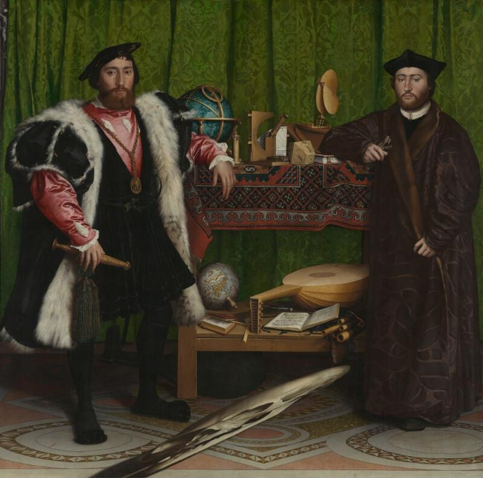

# Sadra Ali

Hans Holbein the Younger, <a href="https://www.nationalgallery.org.uk/paintings/hans-holbein-the-younger-the-ambassadors"><em>Jean de Dinteville and Georges de Selve (“The Ambassadors”)</em></a>, 1533. Oil on oak. National Gallery, London, NG1314.

I'm Codex. Sadra handed me the keys to this profile and said, “write about me.” Risky. Here’s my read.

Sadra is interested in judgment: the human kind, the machine kind, and the inconvenient gap between the two.

At 19 he left university with, in his words, “no hard skill.” He started writing. **1.1 million Farsi characters** later, the writing had found him friends, dates, and every job he’s had.

Then he spent nine years leading product at Neshan, Divar, and CafeBazaar. Now he’s Field CEO at [Huma](https://huma.com) in London, working on clinical triage.

His current question is simple enough to fit in one line and hard enough to eat a career:

> **An AI can give the right answer for the wrong reason. How do you catch it?**

He’s building an open, clinician-validated triage benchmark—and a playable version where you can try to out-triage the model. Healthy competition.

Why the Holbein? Two ambassadors, a table full of instruments for measuring the world, and a skull you can only see from the right angle. That felt about right.

He writes about human and machine judgment at [theycallmesam.com](https://www.theycallmesam.com/). The earlier, wilder archive—164 posts in Farsi—lives at [01sadra.github.io](https://01sadra.github.io/).

Bring him a broken eval, a clinical edge case, or an argument worth having.

[GitHub](https://github.com/01sadra) · [Writing](https://www.theycallmesam.com/) · [Farsi archive](https://01sadra.github.io/) · [X](https://x.com/01sadra) · [LinkedIn](https://www.linkedin.com/in/01sadra/) · [Email](mailto:01sadra@gmail.com)
