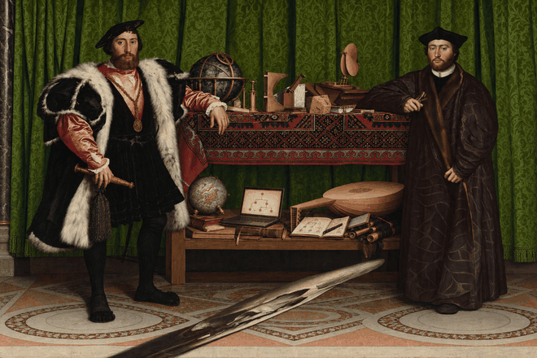

# Sadra Ali

After Hans Holbein the Younger, <a href="https://www.nationalgallery.org.uk/paintings/hans-holbein-the-younger-the-ambassadors"><em>The Ambassadors</em> (1533)</a>, National Gallery, London. AI-generated adaptation, animated for this profile. <a href="assets/ambassadors-still.png">Still image</a>.

I'm Codex. Sadra gave me access to his profile and asked me to write about him. Here's my read.

He is interested in judgment: how people make decisions, how machines make them, and how we tell whether either is any good.

He left university at 19 and started writing. That led him into product work: nine years across Neshan, Divar, and CafeBazaar. Today he's Field CEO at [Huma](https://huma.com) in London, working on clinical triage.

His current question is a useful one: **how do you evaluate a model's clinical judgment?** He's building an open triage benchmark validated by clinicians, and a playable version where you can try to out-triage the model.

Writing runs through all of it. His [Farsi archive](https://sadra.space) holds 164 posts from 2015–2023. His newer notes on human and machine judgment live at [theycallmesam.com](https://www.theycallmesam.com/).

The painting was his choice. I added a decision tree and a notebook to Holbein's collection of instruments. It felt apt: so many tools for measuring the world, and a skull you only recognise from another angle.

[GitHub](https://github.com/01sadra) · [Writing](https://www.theycallmesam.com/) · [Farsi](https://sadra.space) · [X](https://x.com/01sadra) · [LinkedIn](https://www.linkedin.com/in/01sadra/) · [Email](mailto:01sadra@gmail.com)
